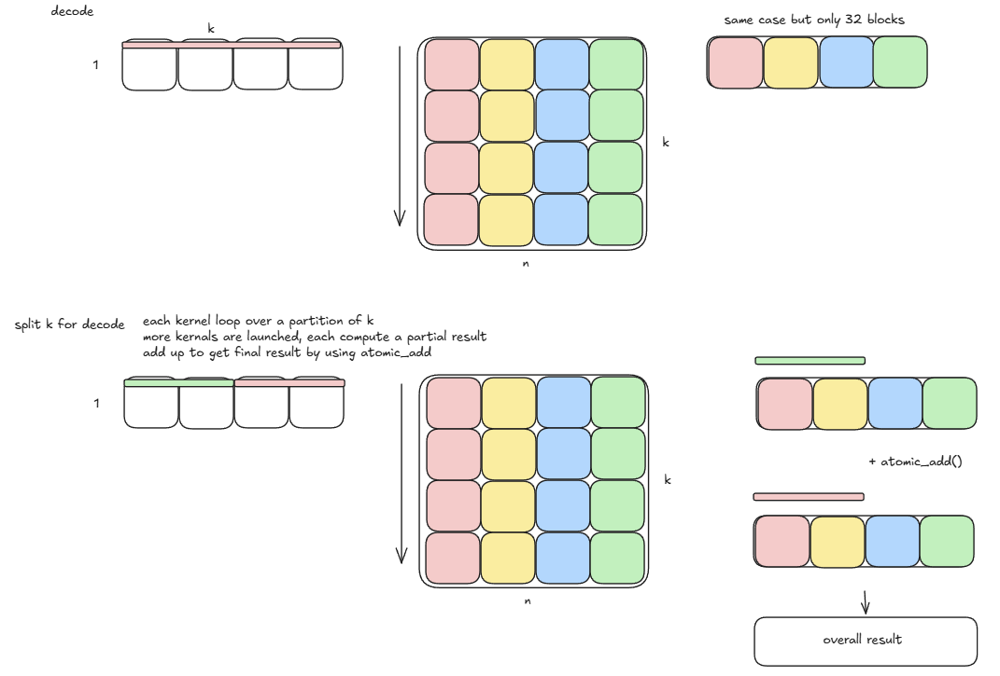

# nano-vllm
A lightweight vLLM implementation built from scratch. Building upon the original [nano-vllm](https://github.com/GeeeekExplorer/nano-vllm.git) repository, this project pushes the framework's capabilities further by introducing advanced quantization support and smart architecture routing.

✨ Key Enhancements:

- Quantization Support: Expanded to natively support Qwen3-FP8 models, utilizing customized Triton kernels to acheive memory savings and gain decode throughput.

- Zero-Code Auto-Routing: A automatic layer dispatch strategy. Simply change the model path, and the engine will automatically parse the model config to switch between standard (BF16) and quantized (FP8) layer implementations without any manual code change.

## Installation

```
pip install https://github.com/zj722/nano-vllm.git
```

## Model Download
To download the model weights manually, use the following command:
```
hf download Qwen/Qwen3-0.6B --local-dir ~/huggingface/model/Qwen3-0.6B
```

## Quick Start
run
```
python3 example.py
```
For different quantization workload, simply change model path, auto dispatch tool will do everything for you.

## Quick Test
```
python3 bench.py
```

## Custom Kernels: Implementation & Benchmarking

Large language model inference consists of two distinct phases: the **prefill phase** (compute-bound) and the **decode phase** (memory-bound). To maximize hardware utilization across both scenarios, we implemented a custom FP8 linear module using Triton. 

The pipeline is divided into two stages: a dynamic quantization kernel and an SM-aware FP8 GEMM kernel.

---

### 1. Dynamic Quantization 
To convert high-precision activations (BF16) into FP8 (`e4m3`), we designed a `fused_dynamic_quantize_kernel`, and fused this kernal to RMSNorm layer.

**Key Features:** 
* **Runtime Quantization**: We conduct dynamic row-wise quantization during inference from BF16 -> FP8 to make sure inference accuracy.
* **Zero Global Memory Overhead:** Fused Kernel avoid writing intermediate unscaled results back to SRAM.
---

### 2. FP8 GEMM 
To fully unlock the hardware potential of FP8, our custom Triton kernels employ a highly specialized, hardware-aware design. We strictly decouple the execution strategy based on the spatial dimension $M$ (where $M = B \times S$) to address the distinct arithmetic intensities of the Prefill and Decode phases.

**Intelligent Heuristic Routing**
Our launcher dynamically inspects the spatial dimension $M$ and routes the workload to the most optimal kernel configuration (adjusting SPLIT_K, block sizes, and pipeline depth) on the fly, ensuring peak performance across both compute-bound and memory-bound regimes.


**Prefill Phase Optimization (Compute-Bound)**

During the prefill phase, where large matrices ($M \ge 64$) generate massive compute workloads, our priority shifts to ALU utilization and register pressure management:
- **Register Pressure Mitigation**: We decrease the software pipelining depth down to `num_stages=2` (double buffering). While deep pipelining hides latency, it consumes vast amounts of SRAM and registers. By stepping down the stages for large blocks, we prevent run out of register resource, freeing up resources for the Tensor Cores to process the heavy ALU workloads.

- **L2 Cache Swizzling**: We implemented a grouped grid scheduling strategy (`_compute_pid_mn`). By reordering the execution sequence of thread blocks into localized groups, we significantly maximize L2 cache hit rates when loading the weight matrices, reducing global memory traffic.

- **Perfect SM Alignment**: We strictly align our block configurations (e.g., $64 \times 32$ or $128 \times 128$) to perfectly feed the 36 Streaming Multiprocessors (SMs) on the RTX 4070 without fragmentation, ensuring no compute unit sits idle.


**Decode Phase Optimization (Memory-Bound)**

During the decode phase, the spatial dimension is extremely small (e.g., $M=1$ to $32$). Compute units are often starved while waiting for weight matrices to load. We applied optimizations to break the memory wall:

- **Latency Hiding via Deep Software Pipelining**: We increased the `num_stages` parameter (e.g., to 3 or 4) to enable deep software pipelining (multi-buffering). This instructs the GPU's DMA engines to asynchronously prefetch future FP8 weight blocks into the fast SRAM in the background while simultaneously computing the current block. This overlap effectively hides the massive global memory latency, maximizing throughput.

- **SM Saturation via Split-K**: For extreme edge cases ($M \le 32$), launching a standard grid leaves the majority of the GPU's SMs under-utilized. To solve this, we employ a **SPLIT_K** algorithm. By partitioning the computation of each row of $M$ along the dimension $K$, we break the workload into hundreds of micro-tasks. This forces all 36 SMs into full occupancy. The partial FP32 results are then safely aggregated using atomic_add operations in a global workspace.


#### Evaluation


##### Test Configuration:
- Hardware: RTX 4070 Laptop (8GB)
- Model: Qwen3-0.6B & Qwen3-0.6b-FP8

To conduct kernal evaluation run:
```
python3 kernel_comparison.py
```

The evaluation is formulated as a general matrix multiplication (GEMM) task. The tensor dimensions are denoted by $M$, $K$, and $N$, where the $M \times K$ matrix represents the input activations and the $K \times N$ matrix represents the model weights. 

Taking the QKV projection as a representative case for our custom kernel, $M$ is defined as the product of batch size and sequence length ($B \times S$), while $K$ represents the hidden dimension ($1024$ for Qwen3). The dimension $N$ corresponds to the total number of attention heads multiplied by the head dimension. Specifically, for a Grouped-Query Attention (GQA) architecture under a single Tensor Parallelism (TP=1) configuration, $N$ equates to $(16 + 8 + 8) \times 128$. The benchmarking results for this configuration are summarized in the following table.

**Table 1.**  FP16 `torch.linear` vs. Custom FP8 Kernel

| Stage | $M (B \times S)$ | $K$ | $N$ | FP16 (ms) | FP8 (ms) | Speedup |
| :--- | :---: | :---: | :---: | :---: | :---: | :---: |
| Prefill | 16 × 128 | 1024 | 4096 | 0.412 | 0.503 | 0.82x |
| Prefill | 32 × 128 | 1024 | 4096 | 0.805 | 0.973 | 0.83x |
| Prefill | 64 × 128 | 1024 | 4096 | 1.567 | 1.894 | 0.83x |
| Prefill | 128 × 128 | 1024 | 4096 | 2.988 | 3.603 | 0.83x |
| Decode | 16 × 1 | 1024 | 4096 | 0.056 | 0.040 | 1.41x |
| Decode | 32 × 1 | 1024 | 4096 | 0.059 | 0.047 | 1.27x |
| Decode | 64 × 1 | 1024 | 4096 | 0.069 | 0.079 | 0.88x |
| Decode | 128 × 1 | 1024 | 4096 | 0.063 | 0.078 | 0.85x |
---


## End-to-End Inference Result

### Table 2. Inference Performance Comparison
#### Test configureation
following test are conducted through `bench.py` where
- `Eager_mode = False`, this would enable cuda_graph
- `ignore_eos=True`, this would remove fluatuation in throughput result due to early finished request in a single batch.

| Batch Size | Input/Output Maxlength | BF16 Overall Throughput | FP8 Overall Throughput | Speedup |
| :---: | :---: | :---: | :---: | :---: |
| 2 | 128/1024 | 261.73tok/s | 289.34tok/s | 1.11x |
| 8 | 128/1024 | 638.12tok/s | 716.67tok/s | 1.12x |
| 16 | 128/1024 | 1213.77tok/s | 1278.59tok/s | 1.05x |
| 16 | 128/2048 | 1002.93tok/s | 1077.57tok/s | 1.07x |
| 32 | 128/1024 | 1618.31tok/s | 1506.88tok/s | 0.93x |
| 32 | 128/2048 | 1272.36tok/s | 1193.27tok/s | 1.06x |
| 32 | 256/1024 | 1690.95tok/s | 1545.66tok/s | 0.91x |
| 64 | 128/1024 | 2425.87tok/s | 2299.74tok/s | 0.94x |

---

### Table 3. Inference-Decode Performance Comparison

| Batch Size | Input/Output Maxlength | BF16 Decode Throughput | FP8 Decode Throughput | Speedup |
| :---: | :---: | :---: | :---: | :---: |
| 2 | 128/1024 | 166tok/s | 171tok/s | 1.030x |
| 8 | 128/1024 | 150tok/s | 164tok/s | 1.093x |
| 16 | 128/1024 | 145tok/s | 177tok/s | 1.221x |
| 16 | 128/2048 | 153tok/s | 180tok/s | 1.176x |
| 32 | 128/1024 | 118tok/s | 154tok/s | 1.305x |
| 32 | 128/2048 | 146tok/s | 171tok/s | 1.171x |
| 32 | 256/1024 | 114tok/s | 174tok/s | 1.526x |
| 64 | 128/1024 | 111tok/s | 170tok/s | 1.532x |
